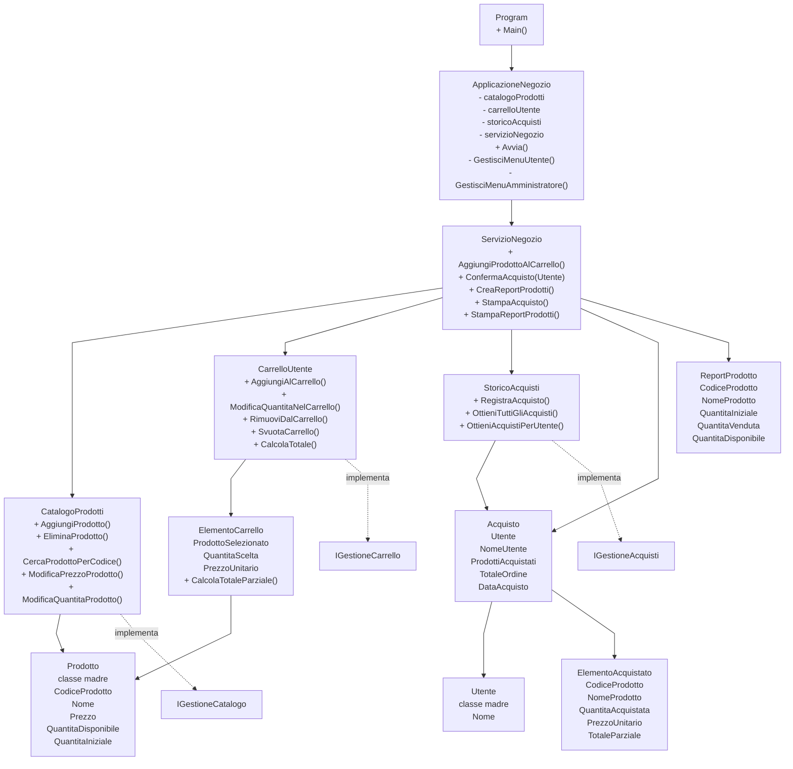

# Template Esame C# - Negozio online

Questo template contiene una Console App C# in un solo file: `Program.cs`.
Non usa namespace e non divide il codice in moduli.
Il file `TestNegozioOnline.cs` è separato dal programma principale e contiene test manuali senza framework esterni.

## Struttura

- `Program`: punto di ingresso dell'applicazione.
- `ApplicazioneNegozio`: gestisce i menu console per utente e amministratore.
- `Utente`: classe madre per rappresentare un utente del sistema.
- `Prodotto`: classe madre per rappresentare un prodotto del catalogo con codice, nome, prezzo, quantità iniziale e quantità disponibile.
- `ElementoCarrello`: rappresenta una riga del carrello con prodotto, quantità scelta e prezzo unitario.
- `Acquisto` ed `ElementoAcquistato`: rappresentano un ordine completato e i prodotti acquistati.
- `CatalogoProdotti`: gestisce prodotti, prezzi e quantità di magazzino.
- `CarrelloUtente`: gestisce aggiunta, modifica, rimozione e totale del carrello.
- `StoricoAcquisti`: conserva in memoria gli acquisti effettuati durante l'esecuzione.
- `ServizioNegozio`: coordina catalogo, carrello e storico, soprattutto nella conferma dell'acquisto.
- `ReportProdotto`: modello semplice per il riepilogo amministratore.

## UML del template

Il template introduce `Utente` e `Prodotto` come classi madri. Gli acquisti sono
associati a un `Utente`, mentre il filtro dello storico continua a usare il nome utente
come richiesto dalla traccia.



## Cosa è già implementato

Sono già pronti alcuni metodi di base e i metodi di visualizzazione, così lo studente può
concentrarsi sulle operazioni richieste dalla traccia:

- caricamento dei prodotti iniziali;
- classe madre `Utente`;
- ricerca prodotto per codice;
- protezione da codici prodotto duplicati;
- calcolo totale carrello;
- svuotamento carrello;
- cambio prezzo con validazione;
- cambio quantità magazzino senza andare sotto zero;
- visualizzazione catalogo;
- visualizzazione carrello;
- visualizzazione storico acquisti di un utente;
- stampa dettaglio acquisto;
- stampa report quantità iniziale, venduta e disponibile.

## Cosa deve essere completato

I metodi con `TODO` devono essere completati senza cambiare firma, nome, parametri o tipo di ritorno.
Le parti principali da implementare sono:

- ciclo principale della Console App;
- menu utente;
- menu amministratore;
- input da console;
- aggiunta/modifica/rimozione prodotti dal carrello;
- modifica/eliminazione prodotti nel catalogo;
- filtro acquisti per nome utente;
- aggiunta prodotto al carrello tramite codice;
- conferma acquisto di un `Utente` con controllo disponibilità, aggiornamento magazzino, storico e svuotamento carrello.

Non è richiesto il salvataggio su file o database: i dati possono restare in memoria durante l'esecuzione.

## Come eseguire i test

Per eseguire i test, chiamare temporaneamente `TestNegozioOnline.EseguiTuttiITest()` dentro `Main` al posto di `applicazione.Avvia()`.

Esempio:

```csharp
public static void Main()
{
    TestNegozioOnline.EseguiTuttiITest();
}
```

Poi eseguire dalla cartella del template:

```bash
dotnet run --project NegozioOnlineTemplate.csproj
```

Se compare l'errore `The name 'TestNegozioOnline' does not exist in the current context`, significa che `TestNegozioOnline.cs` non è nello stesso progetto di `Program.cs`.
Controllare che entrambi i file siano nella stessa cartella del file `NegozioOnlineTemplate.csproj`, oppure aggiungere manualmente `TestNegozioOnline.cs` al progetto dall'IDE.

I test stampano `[PASS]`, `[FAIL]` oppure `[FAIL - TODO]`. I `FAIL - TODO` indicano i metodi ancora lasciati vuoti nel template.


## Comandi utili: 

# git

```bash 
git add .
git commit -m "messaggio"
git push origin
```

# dotnet 
```bash 
dotnet build 
```

```bash
dotnet run
```
o

```bash
dotnet run --project NegozioOnlineTemplate.csproj]
```

# cmd: 

Per impostare il terminale nella cartella del progetto

```bash 
cd [percorso_progetto]
```

## Consigli: 

- eseguire i test
- leggere con attenzione il risultato dei test 
- leggere con attenzione l'output che mostra eventuali errori (distinguando tra errori a Compile Time (errori di sintassi) ed errori a Run Time (metodi/funzioni che non fanno quello che dovrebbero fare)) e guardare il numero della riga in cui è presente l'errore
- git è opzionale


------------------------------------------------------------------
---

# 🛠️ Note di Implementazione dello Studente

Questa sezione documenta il lavoro svolto per completare il template d'esame, illustrando i dettagli dell'architettura e le soluzioni tecniche adottate per implementare le funzionalità richieste.

## 📋 Stato del Progetto e Completamento TODO

Tutti i metodi operazionali contrassegnati inizialmente con `throw new NotImplementedException()` sono stati completati con successo, rispettando rigidamente i vincoli di traccia (firme, nomi, parametri e tipi di ritorno originali sono rimasti invariati).

### ⚙️ Logica di Business e Classi di Dominio Implementate
* **`ElementoCarrello.CambiaQuantitaScelta`:** Inserita validazione robusta che impedisce quantità minori o uguali a zero lanciando un'eccezione descrittiva (`ArgumentException`).
* **`CatalogoProdotti`:** Implementati i metodi di persistenza in memoria:
  * Riconoscimento ed eliminazione dei prodotti tramite codice.
  * Modifica sicura dei prezzi e gestione dei flussi di magazzino (carico/scarico merci) con blocco preventivo dei valori negativi.
* **`CarrelloUtente`:** Implementato il nucleo del carrello della spesa. Gestisce l'accorpamento delle quantità se un prodotto viene aggiunto più volte e valida le richieste in base alle reali disponibilità di magazzino prima dell'acquisto.
* **`StoricoAcquisti`:** Implementato il filtro di ricerca degli acquisti per utente tramite confronti *case-insensitive* per ottimizzare l'esperienza utente.
* **`ServizioNegozio` (Orchestratore):** Completato il metodo critico `ConfermaAcquisto` che esegue in modo atomico le seguenti operazioni:
  1. Verifica dello stato del carrello (impedisce transazioni vuote).
  2. Doppio controllo preventivo delle giacenze.
  3. Decremento controllato del magazzino dei prodotti acquistati.
  4. Generazione dell'oggetto `Acquisto` e archiviazione nello storico globale.
  5. Svuotamento del carrello a transazione conclusa.

---

## 💻 Integrazione dell'Interfaccia Utente (`ApplicazioneNegozio`)

I menu testuali sono stati collegati alle rispettive logiche di business nel seguente modo:

### 👤 Menu Utente
1. **Aggiunta a Carrello:** Collegato all'input del codice prodotto e della quantità desiderata (protetta da inserimenti errati).
2. **Modifica Quantità:** Consente il cambio dinamico delle unità direttamente dall'ID del prodotto.
3. **Rimozione Prodotto:** Permette di scartare un singolo articolo dal carrello senza azzerare il resto.
4. **Checkout (Conferma Acquisto):** Cattura le eccezioni di magazzino e, in caso di esito positivo, stampa a video la ricevuta fiscale dettagliata tramite il `ServizioNegozio`.

### 👑 Menu Amministratore
1. **Eliminazione Prodotto:** Consente la rimozione di un articolo dal catalogo tramite codice univoco.
2. **Variazione Prezzo:** Aggiorna i listini in tempo reale.
3. **Gestione Scorte (Incolla/Preleva):** Permette all'amministratore di inserire variazioni positive (es. rifornimento merci `+10`) o negative (es. merce danneggiata `-2`), mantenendo la consistenza del magazzino.

---

## 🧪 Principi di Qualità e Robustezza del Codice

* **Incapsulamento e Sicurezza:** È stato preservato il design a immutabilità controllata. Nessuna lista interna viene esposta direttamente all'esterno; i metodi usano l'incapsulamento protetto restituendo copie superficiali (`new List<T>`).
* **Integrità dei Dati:** Le transazioni d'acquisto falliscono preventivamente prima di modificare lo stato del magazzino se anche solo uno dei prodotti richiesti risulta esaurito, garantendo la consistenza dei dati.
* **Robustezza ai Crash:** L'interazione con l'utente sfrutta la combinazione di cicli di riprova e metodi protetti da parsing (`TryParse`) per far sì che l'applicazione non crashi mai a fronte di stringhe vuote, caratteri alfabetici al posto di numeri o prezzi negativi.